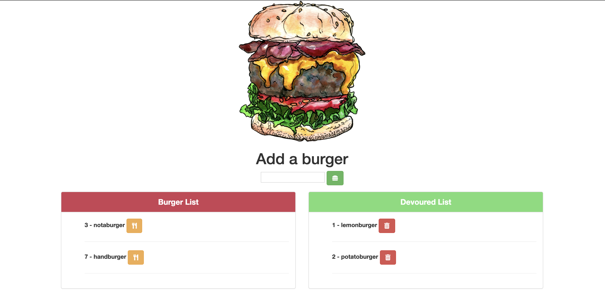

# burger

### App Description
An application using express handlebars for burgers.

### Deployed Application
[Click Here](https://quiet-fjord-56034.herokuapp.com/)

### Instructions to use:
1. Open the link above to access the deployed application
2. Alternatively clone it to your machine, set up the database, and configure the ports

### Node Modules:
* [express](https://www.npmjs.com/package/express)
* [express-handlebars](https://www.npmjs.com/package/express-handlebars)
* [mysql](https://www.npmjs.com/package/mysql)

### Screenshot:
